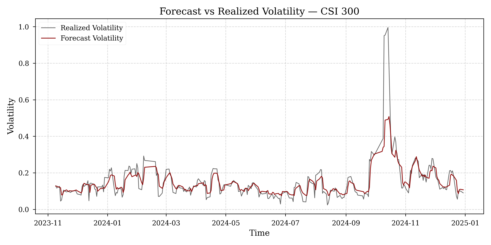
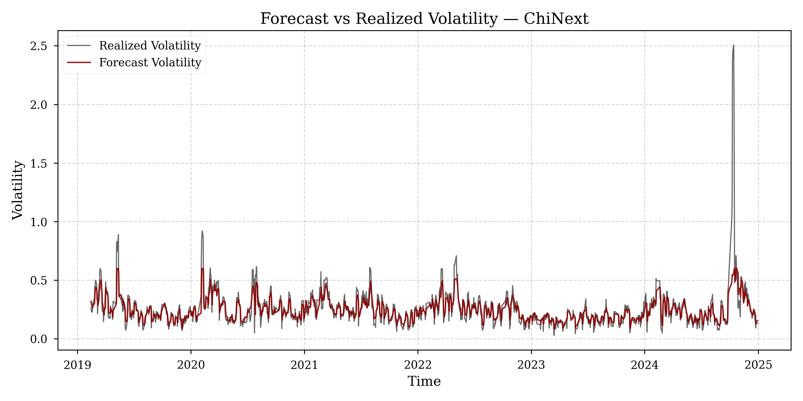

# Empirical Analysis of Volatility and Risk Dynamics in Chinese Equity Markets

**Author:** Amit Kumar Dudi  
**Focus:** Quantitative Finance | Chinese Markets | Volatility Modeling  

## 1. Overview
This repository contains a professional-grade quantitative research pipeline designed to analyze volatility clustering, non-linear shock decay, and tail-risk dynamics within Chinese Equity Markets. 

Understanding variance in Chinese equities presents a unique modeling challenge due to the market's high policy sensitivity and massive retail investor base. This project bridges traditional econometrics with modern machine learning to dynamically forecast volatility across distinct market regimes (efficient large-caps vs. speculative tech boards), ultimately translating these forecasts into robust institutional risk-management protocols.
This project provides a practical framework for understanding and managing volatility in emerging markets, where traditional modeling assumptions often fail due to structural inefficiencies.
This project emphasizes practical risk management applications rather than purely theoretical modeling, highlighting how volatility forecasting directly informs portfolio risk control.

## 2. Methodology
The forecasting and validation framework relies on an out-of-sample 1000-day rolling window methodology:
* **Parametric Benchmarking (HAR-RV / GARCH):** Utilized to map historical variance persistence and linear mean-reversion.
* **Machine Learning Ensembles (Random Forest):** Deployed to capture complex, non-linear policy shock decays using lagged return inputs.
* **Adaptive Hybrid Copula:** Synthesizes parametric stability with ML shock-detection via RMSE-weighted coefficients to maximize forecast correlation.
* **Tail-Risk Modeling (VaR):** Implements dynamic Student-t Value-at-Risk bounds, rigorously validated using Kupiec POF and Christoffersen backtests to ensure sufficient institutional capital protection.
* **Statistical Validation:** Strict enforcement of residual diagnostics via Ljung-Box Q-tests and ARCH-LM tests to identify latent structural inefficiencies.

## 3. Key Results
* **Regime-Dependent Superiority:** The Adaptive Hybrid model demonstrated stronger performance than isolated baselines in mature markets (CSI 300), while raw Machine Learning models proved most effective in moderately inefficient noise-heavy environments (SSE Composite).
* **Universal Fat-Tail Dynamics:** The successful application of Student-t VaR distributions across all tested indices empirically confirmed that standard Gaussian distributions systematically fail to capture extreme downside risk in China.
* **Economic Translation:** Volatility-targeting strategies driven by the Hybrid forecast successfully smoothed equity curves and preserved capital. In the CSI 300, the methodology constrained maximum drawdowns to a manageable -13.17%, generating a robust risk-adjusted Sharpe ratio of 0.65.

## 4. Visualization
The following figures illustrate the alignment between forecasted and realized volatility across different market regimes:

- CSI 300 (efficient market)
- ChiNext (high-volatility emerging market)

These visualizations demonstrate how the model adapts to different structural conditions.




## 5. Project Structure
The repository is structured to prioritize academic clarity and technical reproducibility:
```text
project_root/
├── src/                      # Core quantitative research source code
│   ├── pipeline.py           # Master execution orchestrator
│   ├── forecast_engine.py    # Hybrid and ML volatility models
│   ├── statistical_tests.py  # Residual diagnostics (Ljung-Box, ARCH-LM)
│   ├── risk_metrics.py       # Value-at-Risk (VaR) mapping and backtesting
│   ├── economic_analysis.py  # Strategy simulation and drawdown constraints
│   └── gui/                  # Visualization dashboard (optional interface)
│
├── docs/                     # Academic documentation
│   └── results_analysis.docx # Final Results, Findings, and Hypothesis Validation
│
├── outputs/                  # Computed empirical data matrices
├── main.py                   # CLI/GUI Entry Point
└── README.md
```

## 6. How to Run
Ensure you have all dependencies installed before executing the pipeline or the dashboard.

**Install Dependencies:**
```bash
pip install -r requirements.txt
```

**To run the full econometric pipeline and generate new forecasts:**
```bash
python main.py --run-pipeline
```

**To launch the Bloomberg-style institutional dashboard:**
```bash
python main.py --run-gui
```

## 7. Key Insights
* **Structural Market Inefficiencies:** Persistent ARCH-LM failures in the ChiNext index empirically prove that it operates as a high-noise, speculative regime largely disconnected from standard parametric persistence bounds.
* **Hybrid Model Robustness:** Synthesizing linear persistence with ML-based non-linear shock detection significantly improves predictive accuracy and correlation to realized variance.
* **Practical Fiduciary Utility:** Robust variance forecasting is not purely academic; it is the fundamental mechanism required to dynamically size institutional positions and survive violent structural market crashes.

## 8. Limitations
- Persistent ARCH-LM failures in SSE Composite and ChiNext indicate incomplete capture of extreme volatility clustering  
- Absence of macroeconomic and policy variables may limit explanatory power  
- Machine learning models introduce interpretability constraints  
- Results may be sensitive to rolling window length and parameter selection  

This work demonstrates the importance of combining econometric structure with data-driven methods for robust financial modeling in complex and emerging market environments.
